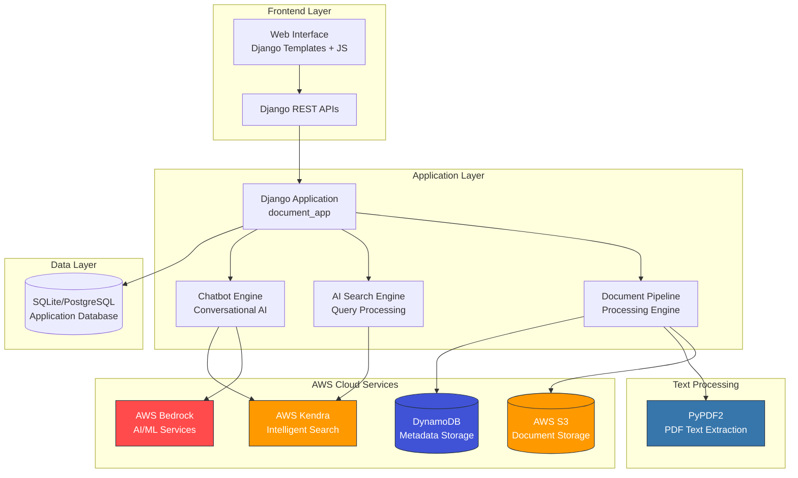

# ApaDocs - Intelligent Document Search & Chat System

<div align="center">


[](https://djangoproject.com/)
[](https://python.org/)
[](https://aws.amazon.com/)
[](LICENSE)

[](https://aws.amazon.com/s3/)
[](https://aws.amazon.com/kendra/)
[](https://aws.amazon.com/bedrock/)
[](https://aws.amazon.com/dynamodb/)
[](https://pypdf2.readthedocs.io/)

</div>

## 🚀 Overview

**ApaDocs** is a cutting-edge, AI-powered document management and search platform that revolutionizes how organizations handle, search, and interact with their document repositories. Built with Django and powered by AWS cloud services, it provides intelligent document processing, contextual search capabilities, and conversational AI interfaces.

### ✨ Current Features

- 📄 **Smart Document Management** - Upload, organize, and categorize documents with AI-powered classification
- 🔍 **Intelligent Search** - Advanced contextual search using AWS Kendra with natural language processing
- 🤖 **AI Chat Interface** - Conversational AI for document queries powered by AWS Bedrock
- 🎨 **Modern UI/UX** - Glassmorphism design with responsive, intuitive interface
- ⚡ **Scalable Architecture** - Cloud-native design with AWS services integration
- 📋 **Document Tracking** - Basic document view and activity logging (RecentView model)

### 🚀 Planned Features & Future Development

- 📊 **Real-time Analytics Dashboard** - Comprehensive analytics for document usage, search patterns, and user interactions
- 🔔 **Notification System** - Real-time alerts for document updates and system events
- 👥 **Multi-user Support** - User authentication, roles, and permissions management
- 🔄 **Advanced Workflow** - Document approval workflows and collaboration features
- 📱 **Mobile Application** - Native mobile apps for iOS and Android
- 🌐 **API Gateway** - RESTful APIs for third-party integrations

## 🏗️ AWS Architecture

<div align="center">



</div>

### 🔧 Current Services Integration

| Service | Purpose | Region | Implementation Status |
|---------|---------|---------|----------------------|
| **AWS S3** | Document storage and file management | `ap-southeast-1` | ✅ **Active** - Primary storage for uploaded documents |
| **AWS Kendra** | Intelligent document search and indexing | `ap-southeast-1` | ✅ **Active** - Powers contextual search capabilities |
| **AWS Bedrock** | AI/ML services for chat and content generation | `us-east-1` | ✅ **Active** - Conversational AI and content analysis |
| **AWS DynamoDB** | NoSQL database for document metadata | `ap-southeast-1` | ✅ **Active** - Stores document metadata and search indices |
| **PyPDF2** | PDF text extraction library | `Local` | ✅ **Active** - Text extraction from PDF documents |

### 🚧 Future AWS Services Integration

| Service | Purpose | Region | Planned Implementation |
|---------|---------|---------|----------------------|
| **AWS Textract** | Advanced OCR and document analysis | `us-east-1` | 🔄 **Planned** - Enhanced text extraction for multiple formats |
| **AWS Comprehend** | Natural language processing | `us-east-1` | 🔄 **Planned** - Advanced text analysis and sentiment processing |
| **AWS Rekognition** | Image and video analysis | `us-east-1` | 🔄 **Planned** - Document image classification and analysis |

## 🛠️ Technology Stack

### Backend
- **Framework**: Django 4.2.16
- **Language**: Python 3.8+
- **Database**: SQLite (Development) / PostgreSQL (Production)
- **Cloud SDK**: Boto3 for AWS integration
- **PDF Processing**: PyPDF2 for text extraction
- **Static Files**: WhiteNoise for static file serving

### Frontend
- **Templates**: Django Templates with Jinja2
- **Styling**: Custom CSS with CSS Variables, Glassmorphism effects
- **JavaScript**: Vanilla JS for dynamic interactions
- **UI/UX**: Modern responsive design with Apple Intelligence-inspired aesthetics

### Cloud & Infrastructure
- **Cloud Provider**: Amazon Web Services (AWS)
- **Deployment**: AWS Elastic Beanstalk ready
- **Storage**: AWS S3 for documents, DynamoDB for metadata
- **AI/ML**: AWS Bedrock, Kendra, Textract, Comprehend
- **Monitoring**: AWS CloudWatch integration ready

## 📋 Core Components

### 1. Document Pipeline (`aws_document_pipeline/`)
- **Purpose**: Handles document upload, processing, and storage workflow
- **Key Files**:
  - `pipeline.py` - Main document processing pipeline
  - `kendra_database.py` - Kendra search integration
  - `dynamodb_storage.py` - DynamoDB metadata storage

### 2. AI Search Engine (`aws_ai_search/`)
- **Purpose**: Intelligent document search with contextual understanding
- **Key Files**:
  - `search_engine.py` - Core search functionality
  - `suggestion_engine.py` - AI-powered search suggestions

### 3. Chatbot Engine (`aws_chatbot/`)
- **Purpose**: Conversational AI interface for document queries
- **Key Files**:
  - `chatbot_engine.py` - AI chatbot implementation with Bedrock integration

### 4. Models & Database
- **Document Model**: Tracks uploaded documents with metadata
- **RecentView Model**: User activity and document access tracking
- **Categories**: Automated document classification system

## 🚀 Quick Start

### Prerequisites
- Python 3.8+
- AWS Account with configured credentials
- Django 4.2+

### Installation

1. **Clone the repository**
   ```bash
   git clone https://github.com/12Lwk/aws-hackathon-intelligent-docsearch-and-chat-system.git
   cd aws-hackathon-intelligent-docsearch-and-chat-system-s3-dynamodb-pipeline
   ```

2. **Install dependencies**
   ```bash
   pip install -r requirements.txt
   ```

3. **Configure AWS credentials**
   ```bash
   # Create AWS credentials file
   cp document_app/aws_credential_keys/config.py.example document_app/aws_credential_keys/config.py
   # Edit with your AWS credentials
   ```

4. **Run migrations**
   ```bash
   python manage.py migrate
   ```

5. **Start the development server**
   ```bash
   python manage.py runserver
   ```

### AWS Configuration

Set up the following AWS services:
- **S3 Bucket** for document storage
- **Kendra Index** for intelligent search
- **DynamoDB Tables** for metadata storage
- **Bedrock Access** for AI capabilities

## 📁 Project Structure

```
aws-hackathon-intelligent-docsearch-and-chat-system/
├── document_app/                 # Main Django application
│   ├── aws_ai_search/           # AI search engine
│   ├── aws_chatbot/             # Conversational AI
│   ├── aws_credential_keys/     # AWS configuration
│   ├── aws_document_pipeline/   # Document processing
│   ├── static/                  # Static files (CSS, JS, images)
│   ├── templates/               # HTML templates
│   ├── models.py                # Database models
│   ├── views.py                 # Application views
│   └── urls.py                  # URL routing
├── document_project/            # Django project settings
├── requirements.txt             # Python dependencies
├── manage.py                    # Django management script
└── application.py              # AWS Elastic Beanstalk entry point
```

## 🎯 Current Implementation Status

### ✅ Implemented Features

#### Document Management
- **PDF Format Support**: Currently supports PDF documents only
- **File Upload Interface**: Basic upload functionality with drag & drop UI
- **Document Storage**: AWS S3 integration for secure file storage
- **Text Extraction**: PyPDF2 library for PDF text extraction
- **Document Models**: Database models for tracking documents and metadata
- **Basic Classification**: Document categorization system (5 categories)

#### Search Capabilities
- **AWS Kendra Integration**: Connected to Kendra for intelligent search
- **Search Interface**: Frontend search page with modern UI
- **Basic Query Processing**: Natural language query handling

#### AI Chat System
- **AWS Bedrock Integration**: Connected to Bedrock for AI capabilities
- **Chat Interface**: Frontend chat interface with conversation flow
- **Document Context**: Basic document-aware responses

#### User Interface
- **Modern Design**: Glassmorphism effects and responsive layout
- **Navigation System**: Consistent sidebar navigation
- **Theme Support**: Basic theme switching functionality

### 🚧 In Development / Future Enhancements

#### Analytics & Monitoring
- **Real-time Analytics Dashboard**: Comprehensive usage analytics
- **Advanced Reporting**: Document usage patterns and insights
- **Performance Monitoring**: System health and performance metrics

#### Enhanced Document Processing
- **Multi-format Support**: DOCX, TXT, images support via AWS Textract
- **Advanced OCR**: Enhanced text extraction for scanned documents
- **Document Analysis**: Content structure and layout analysis

#### Advanced Features
- **Multi-user Authentication**: User roles and permissions
- **Advanced Search Filters**: Category, date, and content-type filtering
- **Document Workflows**: Approval and collaboration features
- **API Endpoints**: RESTful APIs for external integrations

## 🔒 Security & Compliance

- **AWS IAM Integration**: Role-based access control
- **Secure File Upload**: Virus scanning and file validation
- **Data Encryption**: At-rest and in-transit encryption
- **Audit Logging**: Comprehensive activity tracking

## 📊 Performance & Scalability

- **Cloud-Native Architecture**: Designed for AWS scalability
- **Caching Strategy**: Redis integration ready
- **Load Balancing**: AWS ELB compatible
- **Auto-scaling**: Elastic Beanstalk auto-scaling support

## 🤝 Contributing

1. Fork the repository
2. Create a feature branch (`git checkout -b feature/amazing-feature`)
3. Commit your changes (`git commit -m 'Add amazing feature'`)
4. Push to the branch (`git push origin feature/amazing-feature`)
5. Open a Pull Request

## 📄 License

This project is licensed under the MIT License - see the [LICENSE](LICENSE) file for details.

## 🙏 Acknowledgments

- AWS for providing comprehensive cloud services
- Django community for the robust web framework
- Open source contributors and the developer community

---

<div align="center">

**Built with ❤️ for intelligent document management**

[🌟 Star this repo](https://github.com/12Lwk/aws-hackathon-intelligent-docsearch-and-chat-system) | [🐛 Report Bug](https://github.com/12Lwk/aws-hackathon-intelligent-docsearch-and-chat-system/issues) | [💡 Request Feature](https://github.com/12Lwk/aws-hackathon-intelligent-docsearch-and-chat-system/issues)

</div>